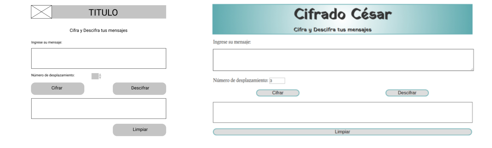
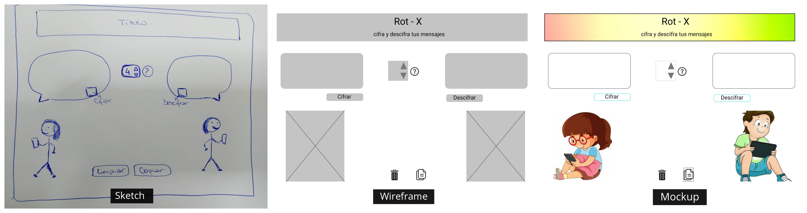
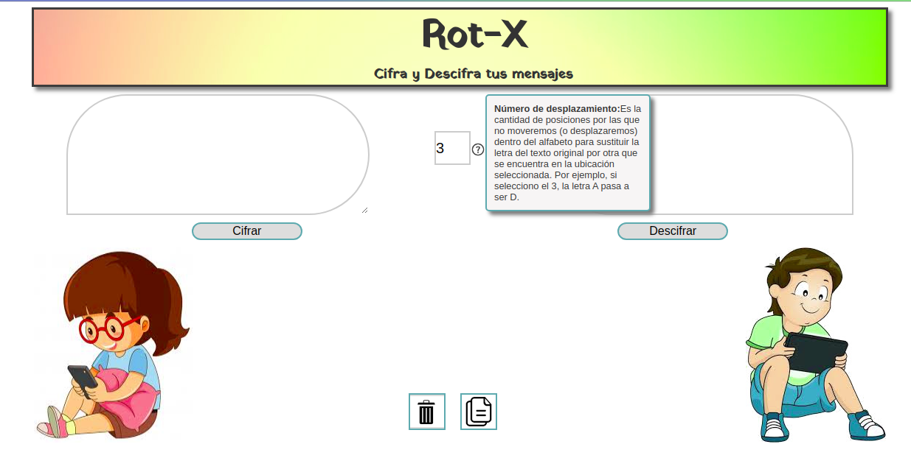

# Cifrado César

Este programa permite cifrar y descifrar mensajes eligiendo un número de desplazamiento, es decir que cada letra del texto original es reemplazada por otra que se encuentra un número fijo de posiciones (desplazamiento) más adelante en el mismo alfabeto.

Por ejemplo, si usamos un desplazamiento de 3 posiciones:

- La letra A se cifra como D.

## Temática

Cifra y descifra datos para un login.

En un principio, la idea surgió por una experiencia personal, ya que en varias ocasiones envié y recibí datos para poder ingresar a una página (usuario y clave), pero al momento de realizar una encuesta noté que habían más personas que también los hacían, por lo que la idea cobró aún mas sentido.

## Diseño

Mi primer diseño fué simple pero lo fuí cambiando al ir reciebiendo feedback de mis compañeras.

En cuanto al diseño final, quería que éste refleje un poco el uso para que el que está pensado este programa, es decir, dos personas enviándose mensajes con datos cifrados.

En un test previo a la finalización del proyecto llegué a la conclusión de que hay personas que no leen textos extensos en una página, sino que van directo a lo que necesitan o se les pide hacer. Por otro lado, hay personas que no saben para que sirve el número de desplazamiento. La solución a esto fue agregar un tooltip que explique de forma breve su utilidad. Esta misma técnica se utilizó para los botones de “Borrar” y “Copiar” ya que son sólo imágenes.

## Pruebas de Usabilidad

*Objetivo: Enviar un mensaje secreto con los datos para ingresar a una página (Usuario y Clave).

*Las personas que probaron la página están dentro de un rango de 24 a 55 años 

[Usuario 1](https://www.loom.com/share/248943cc2fe347e48306f17aaeb8cd35?fbclid=IwAR3jjU_vj_v0QL0fg7ObFOILzboidz-skCN3inCWuP_xPXJX3lTsKd5w--g)

[Usuario 2](https://www.loom.com/share/ba0db71cb5ec408093eaa4381406027f)

[Usuario 3](https://www.loom.com/share/881f78472bfe430dad8876599584bcd9)

[Usuario 4](https://www.loom.com/share/0632d50d0d2547a5920410558d6c8104)

[Usuario 5](https://www.loom.com/share/34055fcac7284122b42c3ce2f04417a6)

## Conclusión del Proyecto 

### Técnica
La página cumple con los requerimientos. Cifra y descifra letras mayúsculas, minúsculas, caracteres especiales, vocales con acento, números y reconoce espacios. También permite el uso de un offset negativo.

### UX
Como punto a considerar, sólo uno de los usuarios se detuvo a leer el tooltip con la explicación de lo que es un número de desplazamiento.
Hubo confusión en el área de descifrado ya que creyeron al obtener el mensaje cifrado presionar el botón de “Descifrar”, éste volvía a texto plano.

### UI
Cumple con los requerimientos.  Tiene un área para ingresar el mensaje cifrado y descifrado, otra para ver el resultado, y el usuario puede seleccionar un número de desplazamiento. 
